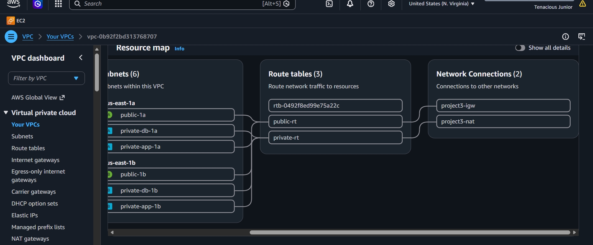
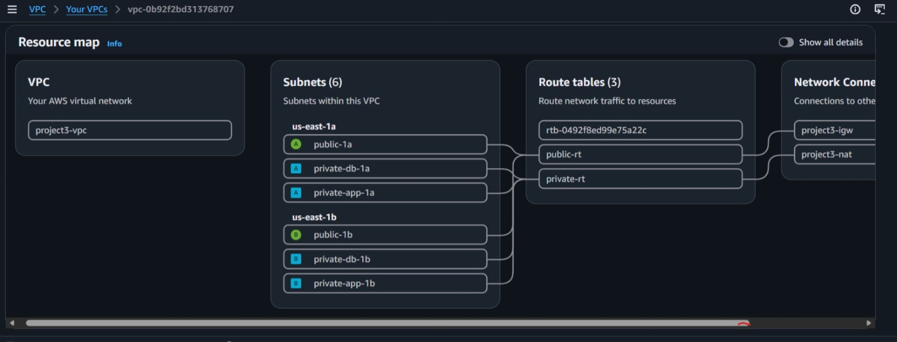
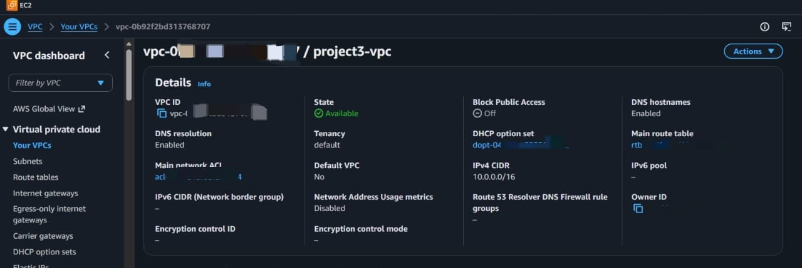

# 🏗️ Terraform AWS 3-Tier VPC - Production Grade

Production-ready Highly Available VPC architecture built with Terraform.

## Architecture
- **VPC:** 10.0.0.0/16
- **6 Subnets across 2 AZs (eu-north-1a, 1b):**
    - 2x Public (Web Tier) - with IGW
    - 2x Private App Tier - with NAT
    - 2x Private DB Tier - isolated
- **Components:** IGW, NAT Gateway, 3 Route Tables

## Diagram
## 📸 AWS Console Proof

### VPC Resource Map - 3-Tier Architecture

- 6 Subnets (2 Public, 2 App Private, 2 DB Private) across us-east-1a & 1b
- 3 Route Tables (public-rt, private-rt)
- 2 Network Connections (IGW + NAT)

##VPC Resource Map - 2nd image 

### VPC Details - Live Deployment

- VPC ID: vpc-0*********
- State: Available 
- CIDR: 10.0.0.0/16
- DNS Hostnames: Enabled

Deployed via Terraform from Kali Linux (VirtualBox) in Accra, Ghana 🇬🇭
